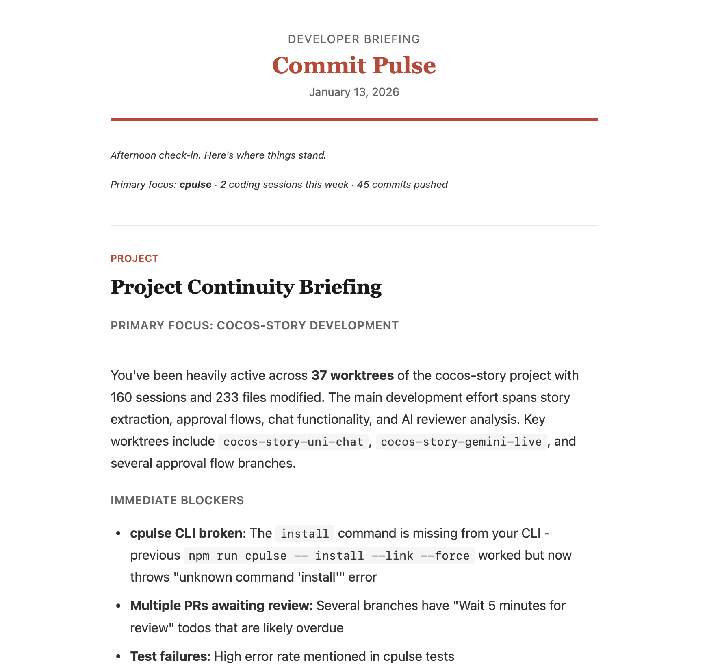
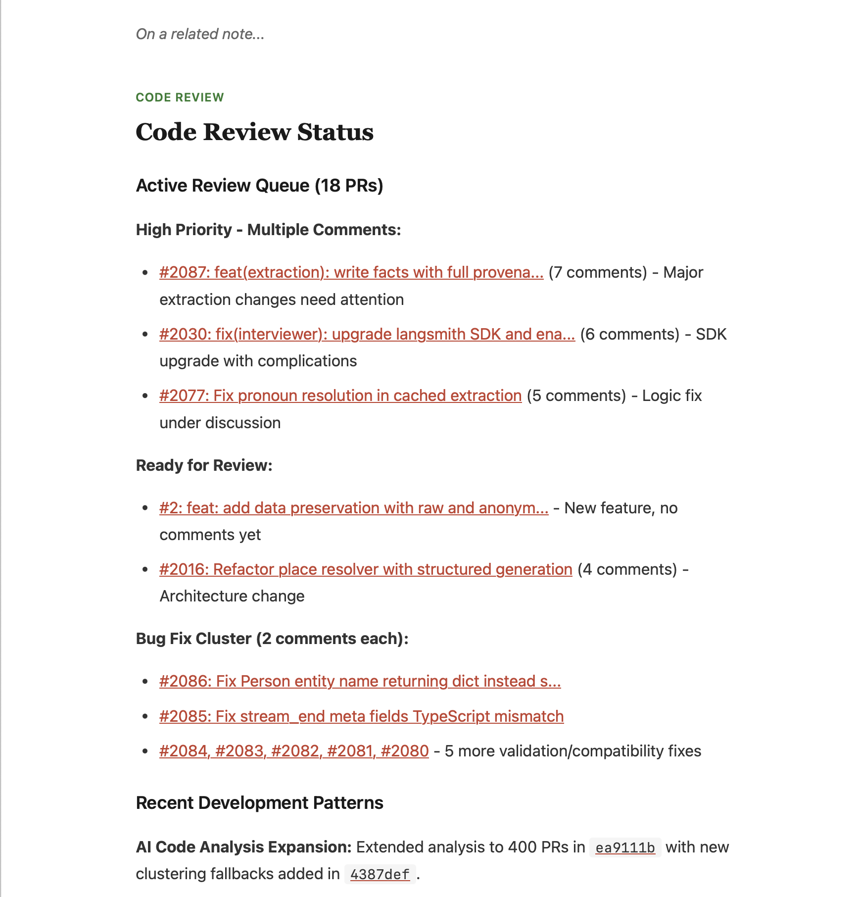
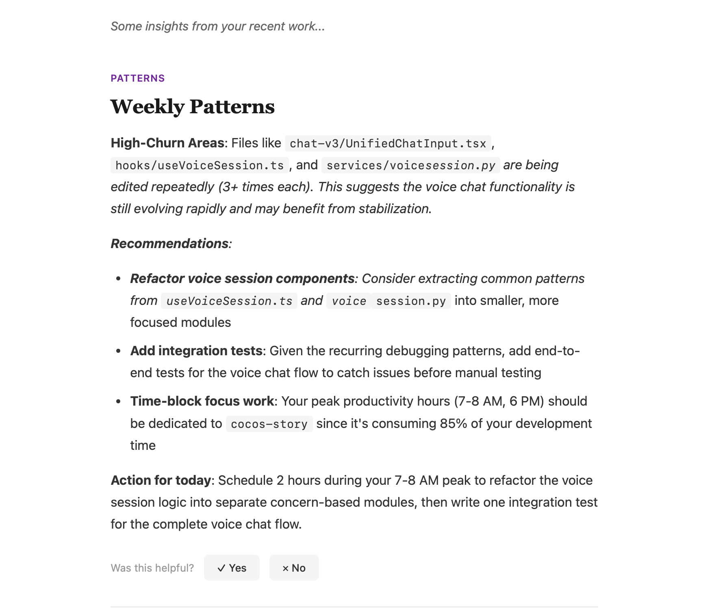

# Commit Pulse

Commit Pulse - Wake up to a daily briefing of your dev activity. Parses Claude Code sessions + GitHub to surface open todos, stale PRs, post-merge feedback, and AI-powered advice formatted as CLAUDE.md rules. Your morning coffee companion for staying oriented. ☕

Commit Pulse analyzes your development activity over the past week and generates concise, actionable briefings delivered to your email each morning.

## Inspiration

This was inspired by ChatGPT Pulse. As of 13 Jan 2026, Pulse is only available to ChatGPT Pro subscribers ($200/month)

## Example Briefing

<table>
<tr>
<td width="60%">

</td>
<td width="40%" valign="top">

**Project Continuity** cards summarize your Claude Code sessions, files modified, and immediate blockers detected from your conversations.

</td>
</tr>
<tr>
<td width="60%">

</td>
<td width="40%" valign="top">

**Code Review** cards show your active PR queue grouped by priority and comment count, with direct links to GitHub.

</td>
</tr>
<tr>
<td width="60%">

</td>
<td width="40%" valign="top">

**Patterns** cards analyze your development habits and provide actionable recommendations based on file churn and session activity.

</td>
</tr>
</table>

## Features

- **Claude Code Integration**: Parses your Claude Code session logs to identify projects worked on, open todos, and unresolved errors
- **GitHub Integration**: Summarizes commits, open PRs, review requests, and stale branches
- **AI-Powered Summaries**: Uses Claude to synthesize activity into actionable insights
- **Actionable Closing**: Every briefing ends with specific "Start Here" actions, priority items, and quick wins
- **Smart Prioritization**: Automatically detects blockers, recurring todos, and urgent items
- **PR Urgency Tracking**: Highlights stale PRs and how long review requests have been waiting
- **Post-Merge Severity**: Classifies feedback on merged PRs as critical, suggestion, or question
- **Memory System**: Project-specific context via memory.md files
- **Email Delivery**: Sends styled HTML briefings via SMTP (works with Gmail, Fastmail, etc.)
- **Terminal Preview**: ANSI-formatted briefings for terminal viewing
- **Web Dashboard**: Local web UI to browse briefing history and analytics
- **Indefinite History**: Stores all briefings locally for future reference

See [docs/FEATURES.md](docs/FEATURES.md) for detailed feature documentation.

## Requirements

- Node.js 18.x or later
- Anthropic API key
- GitHub personal access token
- SMTP credentials (e.g., Gmail app password)

## Installation

### Install Globally

```bash
git clone https://github.com/qfennessy/cpulse.git
cd cpulse
npm install
npm run link
```

This builds the project, creates a global `cpulse` command via npm link, and installs the man page to `/usr/local/share/man/man1/`.

After installation:
- Run `cpulse --help` from anywhere
- Run `man cpulse` for documentation

To uninstall:

```bash
npm run unlink
```

### Run from Source (Development)

```bash
git clone https://github.com/qfennessy/cpulse.git
cd cpulse
npm install
npm run cpulse -- --help
```

## Configuration

1. Create the config file:

```bash
cpulse init
```

2. Edit `~/.cpulse/config.yaml`:

```yaml
email:
  to: you@example.com
  from: you@example.com
  send_time: "06:00"
  timezone: "America/Los_Angeles"
  smtp:
    host: smtp.gmail.com
    port: 587
    secure: false
    auth:
      user: you@example.com
      pass: your-app-password

sources:
  claude_code:
    enabled: true
    log_path: ~/.claude/
  github:
    enabled: true
    repos: []  # Empty = all accessible repos
    include_private: true

preferences:
  article_style: concise
  max_cards: 5
  enabled_cards:
    project_continuity: true
    code_review: true
    open_questions: true
    patterns: true
    post_merge_feedback: true
```

3. Set permissions:

```bash
chmod 700 ~/.cpulse
chmod 600 ~/.cpulse/config.yaml
```

4. Set environment variables (alternative to config file):

```bash
export ANTHROPIC_API_KEY=sk-ant-...
export GITHUB_PERSONAL_ACCESS_TOKEN=ghp_...
```

## Usage

### Generate Briefings

```bash
# Preview what signals would be collected (no API calls to Claude)
cpulse preview

# Generate a briefing and print to stdout
cpulse generate --preview

# Generate and send briefing via email
cpulse generate

# Generate all card types regardless of weekly rotation
cpulse generate --all-cards --preview

# View briefing history and stats
cpulse history

# Show current configuration
cpulse config
```

### Generate Options

| Option | Description |
|--------|-------------|
| `--hours <n>` | Hours of history to analyze (default: 168 = 7 days) |
| `--preview` | Print to stdout instead of sending email |
| `--all-cards` | Generate all card types, bypassing weekly rotation |
| `--simple` | Use simple formatting without narrative transitions |
| `--no-send` | Generate but don't send email |
| `--no-save` | Generate but don't save to history |

### Other Commands

```bash
# Show development patterns from sessions
cpulse patterns

# Show open questions from sessions
cpulse questions

# Submit feedback for the latest briefing
cpulse feedback <card-index> <helpful|not_helpful|snoozed>

# Show feedback statistics
cpulse feedback-stats

# Set topic priority
cpulse priority <topic> <high|normal|low|ignored>

# Show current topic priorities
cpulse priorities

# Show memory context status
cpulse memory

# Start the web dashboard
cpulse serve --port 3000
```

## Scheduling

To receive daily briefings, add a cron job:

```bash
crontab -e
```

**Important:** Cron runs with a minimal environment - it doesn't have your shell's PATH or environment variables. You need to configure these explicitly.

If you keep your API keys in a secrets file (e.g., `~/.zshrc.secrets`):

```
# Required: Set PATH to include node (find yours with: which node)
PATH=/Users/yourname/.nvm/versions/node/v20.19.0/bin:/usr/local/bin:/usr/bin:/bin

# Run at 6am daily, sourcing secrets file for API keys
0 6 * * * /bin/bash -c 'source ~/.zshrc.secrets && node ~/.cpulse/bin/cli.js generate' >> ~/.cpulse/cron.log 2>&1
```

Your secrets file should contain exports like:
```bash
export GITHUB_PERSONAL_ACCESS_TOKEN='ghp_xxxxx'
export ANTHROPIC_API_KEY='sk-ant-xxxxx'
```

Alternatively, set the API keys directly in the crontab:

```
PATH=/Users/yourname/.nvm/versions/node/v20.19.0/bin:/usr/local/bin:/usr/bin:/bin
GITHUB_PERSONAL_ACCESS_TOKEN=ghp_xxxxx
ANTHROPIC_API_KEY=sk-ant-xxxxx

0 6 * * * node ~/.cpulse/bin/cli.js generate >> ~/.cpulse/cron.log 2>&1
```

Check `~/.cpulse/cron.log` if briefings aren't arriving to debug any issues.

## Card Types

Commit Pulse generates several types of briefing cards:

| Card | Description |
|------|-------------|
| **Project Continuity** | What you worked on, files modified, open todos, suggested next steps |
| **Code Review** | Recent commits, open PRs, review requests, stale branches |
| **Open Questions** | Unresolved questions from Claude Code sessions |
| **Patterns** | Development patterns and habits from your sessions |
| **Post-Merge Feedback** | Comments added to PRs after they were merged |

Use `--all-cards` to generate all card types regardless of weekly rotation.

## Privacy

- All data stays local (in `~/.cpulse/`)
- Only extracted signals are sent to Claude API, not full conversation logs
- GitHub token is stored locally or in environment variables
- You can audit what's sent by running `cpulse preview`

## Links

- Repository: https://github.com/qfennessy/cpulse
- Issues: https://github.com/qfennessy/cpulse/issues
- Documentation: [docs/FEATURES.md](docs/FEATURES.md)

## License

MIT
